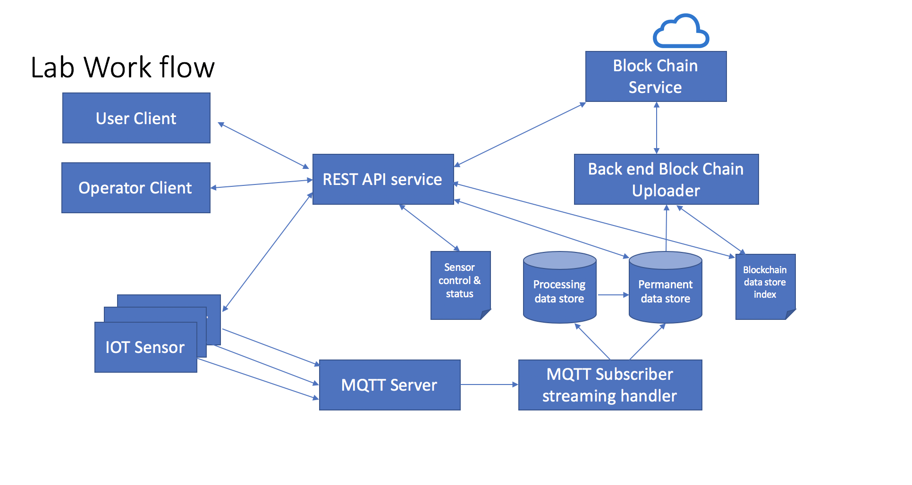
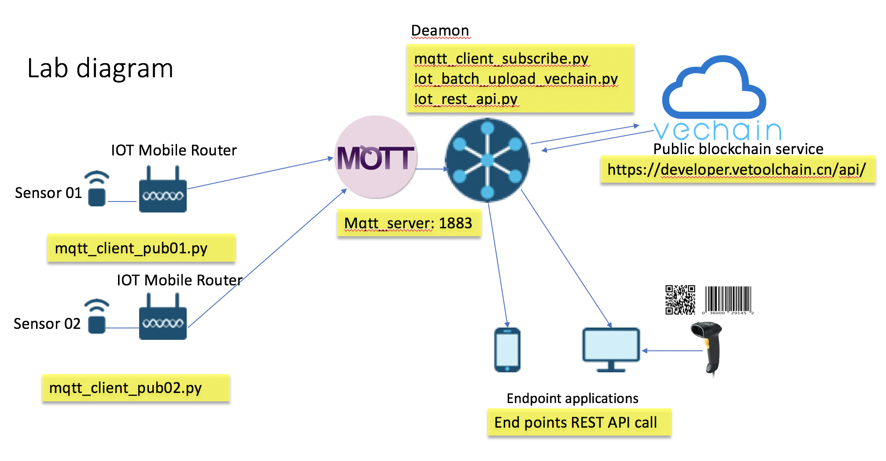

### IOT Block Chain Lab
    

##### IOT lab for testing Cisco IR809 and Raspberry Pi integrate with Vechain public block chain

#### Lab Environment
    VeChain public cloud Block Chain service API
    MQTT message server
    Arm embedded linux sensor

#### cent os 7 install mosquitto server

    sudo yum -y install epel-release
    sudo yum -y install mosquitto
    sudo systemctl start mosquitto
    sudo systemctl enable mosquitto

    mosquitto_sub -h localhost -t test
    mosquitto_pub -h localhost -t test -m "hello world"

#### Python 3.7 requirements
   
    paho-mqtt==1.5.0
    requests==2.22.0

#### Demo Code
    
    
    mqtt_client_pub03.py run as sensor simulator data source input , publish message to topic "sensor"
    
    mqtt_client_subscrib01.py run as deamon , subscribe MQTT topic "sensor", recevice message from MQTT broker,
    each time pub publish a series message begin with "START" and then sensor data, end end of "STOP"    
    mqtt_client_subscrib.py parse message , and store data in local disk , file name with message embeded "order No"
    
    mqtt_client_subscrib02.py is simply monitor mqtt topic message , for debug only.
    
    iot_batch_upload_vechain.py run as deamon, check disk store files , when new files achived , it will generate file contenet data hash
    and upload the data has to vechian block chian with "order No." and sub account "sensor" ,and get a unique "vid" as 
    blockchain key, then store the "vid" pair with "order No." to local file iot_order_vid.
    
    iot_batch_verify_vechain.py and iot_single_verify.py use to verify local stored file dignity ,generate file dada hash
    and query from vechain blockchain with local stored peer "vid" for specific "order No." or batch of whole stored "order No."
    if stored "order No." file contenet was changed , file data hash will mismatch the data hash queryed from blockchian,
    warnning will be reported .
    
    iot_env has the iot related paramaters .
    
    vechain_env has the block chain API related.
    
    vechian_lab.py is an example code for vechain class function .
    

####    REST API Guide
    
    Config sensor , setup sensor id , orderNo and start/stop sending message
    POST    URL http://SERVER-IP:PORT/sensorcontrol
    HEADER  Accept:application/json
    BODY {   "sensor_id": "07",
             "control":{"flag": "STOP",
                        "orderNo": "0071"}
          }
          
    sensor_id : string        |  mandatory
    flag : string             |  mandatory   START   STOP
    orderNo : string          |  mandatory 
    
####   
    
    Get sensor status 
    POST    URL http://SERVER-IP:PORT/sensorstatus
    HEADER  Accept:application/json
    BODY {   "sensor_id": "06"}

    sendor_id : string        | mandatory
    
    sample response 
    {
      "flag": "STOP",
      "orderNo": "0062"
    }
         
####

    Get batch block chain verification result
    GET     URL http://SERVER-IP:PORT/batchblockchaincheck
    HEADER  Accept:application/json
    BODY none
    
    sampele response
    {
    "result": [
        {
            "orderNo": "0032",
            "status": "Blockchain Verified"
        },
        {
            "orderNo": "0033",
            "status": "Blockchain NOT Verified, data changed"
        },
        {
            "orderNo": "0018",
            "status": "Blockchain Verified"
        },        
    ],
    "total_time": 26
    }
    notice : long duration ...
    
####

    Get Single block chain verification result
    POST   URL http://SERVER-IP:PORT/singleblockchaincheck
    HEADER  Accept:application/json
    BODY {"orderNo": "0088"}
    
    orderNo : string     |   mandatory
    
    sample response
    {
    "orderData": "['25/12/2019 03:04:48 21.64', 
                   '25/12/2019 03:04:58 21.64', 
                   '25/12/2019 03:05:08 21.64', 
                   '25/12/2019 03:05:19 21.64', 
                   '25/12/2019 03:05:29 21.64', 
                   ........
                   '25/12/2019 03:29:07 21.72']",
    "status": "Verified"
}
    
    
    
#### TODO
    
    Solid code with more exception throw out and handler , 
    SQL for local kv status lock store
    Multithread batch data hash upload 
    console print convert to logging 
    
    
### IR 809 RS485 GPS lab

#### IR809 router config
    
      IOS version 15.9(3)M
      Image ir800-universalk9-mz.SPA.159-3.M
      
      IR809 config detail , refer to ./iox_485_gps/IR809_config_sample
      
      
#### Base docker image build iox_python2:v1

    docker pull devhub-docker.cisco.com/iox-docker/ir800/python-2.7.11

    docker run -it devhub-docker.cisco.com/iox-docker/ir800/python-2.7.11
    
    #opkg update
    #opkg install python-pip
    #pip install paho-mqtt
    #pip install requests
    #pip install pyserial
    
    #opkg install python3
    #opkg install python3-pip
    #pip3 install paho-mqtt
    #pip3 install requests
    #pip3 install pyserial

    docker ps -all
    CONTAINER ID        IMAGE                                                    COMMAND             CREATED             STATUS                      PORTS               NAMES
    1b3af2f6ee2b        devhub-docker.cisco.com/iox-docker/ir800/python-2.7.11   "/bin/sh"           8 minutes ago       Exited (0) 42 seconds ago                       strange_goldwasser
    
    docker commit -m "thin iox" -a "thin iox python2" 1b3af2f6ee2b iox_python2:v1

#### Edit Docker file Dockerfile

    FROM iox_python2:v1

    COPY main.py /main.py
    
    # refer to ./iox_485_gps folder Dockerfile
    
#### Edit package file package.yaml

    # refer to ./iox_485_gps folder package.yaml
    
#### Edit docker mapping file activation.json

    # refer to ./iox_485_gps folder activation.json
    
#### Build Appliation doccker image and install to IR809 thenactiate and start

    use ioxclient to upload sercei application docker iamge and activate and run
    
    #refer to ./iox_485_gps folder auto_build_sample
    
    
#### Demo Guide
    
    clone git 
    modify IR809 config 
    modify main.py
    
    REST_API_HOST = "http://192.168.1.10:5000/" #edit rest api server ip adress 
    MQTT_HOST= "192.168.1.100" # edit mqtt server ip addresss
    
    modify auto_build.sh with your own enviroment 
    
    rebuild docker image and ioxclient docker package before demo
    

#### misc

    RS485 modbus query    \x01\x03\x00\x00\x00\x02\xc4\x0b  # device id = 1
    
    GPS info use $GPRMC,065832.0,A,3954.064341,N,11637.305742,E,0.0,0.0,190120,6.0,W,A*1A
    #check IR809 gps : 
        
        show cell 0 gps
    
    #check Docker service via guest OS virsh console :
    
        #ssh -p 2222 cisco@192.168.1.144 
        #virsh
        virsh# list
        virsh# console <APP_ID>   
        
        output as following sample 
        
        Temperature is 27.9
        $GPVTG,214.0,T,220.0,M,0.0,N,0.0,K,A*24
        
        19/01/2020 10:00:09 IR809 0019 3954.067774N/11637.298753E,27.9
        $GPRMC,093915.0,A,3954.067771,N,11637.298748,E,0.0,214.0,190120,6.0,W,A*1B
        
        $GPRMC,093915.0,A,3954.067771,N,11637.298748,E,0.0,214.0,190120,6.0,W,A*1B
        
        $GPGSA,A,2,04,07,08,09,23,,,,,,,,2.0,1.8,0.9*32
        
        $GNGSA,A,2,04,07,08,09,23,,,,,,,,2.0,1.8,0.9,1*31
        
        $GNGSA,A,2,66,76,75,65,,,,,,,,,2.0,1.8,0.9,2*31
    
        
#### check with local manager https://192.168.1.144:8443/admin
    

